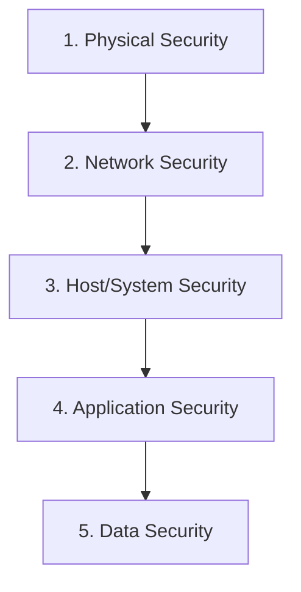

# Cloud Computing (231AM6E01) UNIT-IV: Comprehensive Exam Report

> [!NOTE]
> This document provides highly detailed answers to your Unit-IV questions. It focuses on Cloud Security, Economics, and Federation. The content is structured with clear definitions, diagrams, and examples to help you score 15 to 20 marks per question.

---

## 1. Explain about technologies for cloud federation.

**Introduction to Cloud Federation:**
Cloud Federation (or Federated Cloud) means combining multiple different cloud providers (like AWS, Microsoft Azure, and Google Cloud) into one large, connected system. Why do this? If one cloud gets full or goes down, the system automatically uses another cloud.

To make different clouds "talk" and work together, specific technologies are required:

**1. Interoperability APIs (Open APIs):**
- **What it is:** APIs are language translators between computers. 
- **Role:** Every cloud provider builds their system differently. Open APIs act as a universal plug that allows AWS to send data to Azure without errors.

**2. Identity and Access Management (IAM) Technologies:**
- **What it is:** Managing usernames and passwords across multiple clouds.
- **Role:** If a user logs into AWS, they shouldn't have to log in again for Azure. Technologies like **SAML** (Security Assertion Markup Language) and **OAuth** allow "Single Sign-On" (SSO). One login unlocks the entire federated system.

**3. Software-Defined Networking (SDN) and VPNs:**
- **What it is:** Secure, virtual communication lines.
- **Role:** If data moves from a private cloud in your office to a public cloud in America, it must travel over the public internet. Technologies like IPsec VPNs and SDNs create an invisible, encrypted tunnel to keep hackers from stealing the data during transit.

**4. Cloud Service Brokers (CSB):**
- **What it is:** A middleman software.
- **Role:** The broker constantly monitors all connected clouds. If a customer asks to run a program, the broker checks which cloud is the cheapest or fastest right now and automatically sends the work there.

---

## 2. Illustrate the concept of cloud security architecture.

**Introduction:**
Cloud Security Architecture is the step-by-step master plan of how to protect data, applications, and networks in the cloud. Think of it like building a castle. You don't just put a lock on the door; you have a moat, high walls, guards, and a safe room. 

**The Layers of Security (Defense-in-Depth):**

**Detailed Layer Explanation:**
1. **Physical Security layer:** 
   - Managed by the cloud provider (like Amazon). It involves fingerprint scanners, armed guards, and security cameras at the actual data center building.
2. **Network layer:**
   - Setting up **Firewalls** and **Virtual Private Clouds (VPCs)**. It blocks bad internet traffic and hackers from entering the system.
3. **Host/System layer:**
   - Protecting the Virtual Machines (VMs) and Operating Systems. This is done by installing antivirus software and running regular security updates (patching).
4. **Application layer:**
   - Making sure the software code itself has no bugs. A **Web Application Firewall (WAF)** is used to block bad inputs (like SQL Injection) from attacking web forms.
5. **Data layer (The Core):**
   - The most important layer. Data is protected using **Encryption**. If a hacker steals the data, it looks like unreadable garbage unless they have the secret decryption key.

---

## 3. Define vulnerabilities, threats, and risks.

To get maximum marks, provide a clear definition of each and tie them together with a real-world example.

**1. Vulnerability (The Weakness)**
- **Definition:** A flaw or weakness in a system's design, software code, or security procedures. 
- **Simple term:** An open door or a broken lock.
- **Cloud Example:** Running an old version of Windows Server that hasn't been updated in three years.

**2. Threat (The Danger)**
- **Definition:** Anything that can intentionally or accidentally exploit (take advantage of) a vulnerability to cause damage or steal data.
- **Simple term:** A thief walking around looking for open doors.
- **Cloud Example:** A hacker creating a virus designed to attack old versions of Windows.

**3. Risk (The Probability & Impact)**
- **Definition:** The mathematical chance that a *threat* will exploit a *vulnerability*, combined with the amount of damage it will cause. 
- **Simple term:** The chance of your house being robbed and losing $10,000.
- **Cloud Example:** If you run an old Windows Server containing private credit card data, the *Risk* is extremely high because the weakness exists, hackers exist, and the financial impact would destroy the company.

**Equation:** `Risk = Vulnerability × Threat`

---

## 4. Summarize the concept of shared responsibility model with examples.

**Introduction:**
The Shared Responsibility Model is the most important rule in cloud computing. It means that cloud security is a team effort. The Cloud Provider and the Customer split the security duties. 

**The Golden Rule:**
- **Cloud Provider:** Is responsible for the security **OF** the cloud (Hardware, physical buildings, raw network).
- **Customer:** Is responsible for security **IN** the cloud (Data, passwords, operating system settings).

**Breakdown by Service Type:**

| Service Model | Provider Responsibility (e.g., AWS) | Customer Responsibility (You) |
| :--- | :--- | :--- |
| **IaaS (Infrastructure)** | Physical security, hard drives, cooling, networking wires. | Operating system updates, firewalls, passwords, data encryption. *(Customer does most of the work).* |
| **PaaS (Platform)** | Hardware, Network, and the Operating System. | Application code, Data, and User Passwords. |
| **SaaS (Software)** | Hardware, OS, Application code, and Network. (e.g., Gmail) | Only responsible for who they give passwords to and classifying data. *(Provider does most of the work).* |

**Example Scenario:**
If a hacker physically breaks into an Amazon datacenter and steals a hard drive, it is **Amazon's fault**.
If you leave your AWS password as "12345" and a hacker logs in and deletes your virtual machines, it is **Your fault**.

---

## 5. Write a short note on securities in cloud deployment models.

Different cloud deployments (Public, Private, Hybrid) have drastically different security profiles.

**1. Security in Public Cloud (AWS, Google Cloud)**
- **Concept:** Multitenancy. You share the physical hardware with hundreds of other unknown companies.
- **Security Focus:** Because you share hardware, strong isolation is mandatory. Security relies heavily on the Cloud Provider's hypervisor. 
- **Advantage:** Providers invest billions in security, usually better than what a small company can afford.
- **Weakness:** You lose physical control over your data.

**2. Security in Private Cloud**
- **Concept:** Single-tenant. A server rack used exclusively by one single company, located in their own building.
- **Security Focus:** The company owns the firewall, the hardware, and the cables. 
- **Advantage:** Maximum control and privacy. Perfect for highly regulated industries like hospitals (HIPAA) or military.
- **Weakness:** If the company's internal IT team is lazy, a private cloud can easily be hacked. It is expensive to secure properly.

**3. Security in Hybrid Cloud**
- **Concept:** Mixing Private and Public clouds. The core data stays in the private cloud, and web-servers run in the public cloud.
- **Security Focus:** The biggest security risk is data moving *between* the public and private clouds. 
- **Solution:** Strong VPN encryption and strict firewalls are required at the connection point between the two environments.

---

## 6. What are the core fundamentals of computer security?

The fundamentals are universally known as the **CIA Triad**. For extra marks, add two more modern fundamentals.

**1. Confidentiality (Privacy)**
- **Meaning:** Keeping data secret. Only authorized people should be able to read it.
- **How it works:** If a hacker steals a file, they shouldn't be able to read it.
- **Cloud Tool:** Data Encryption (turning the data into scrambled code) and strong passwords.

**2. Integrity (Accuracy)**
- **Meaning:** Ensuring data is not changed or corrupted by an unauthorized person. 
- **How it works:** If you send a bank transfer for $100, a hacker shouldn't be able to intercept the message and change it to $10,000.
- **Cloud Tool:** Checksums and Hashing (a mathematical stamp that proves the file was never modified).

**3. Availability (Uptime)**
- **Meaning:** Data and services must be available to authorized users exactly when they need them.
- **How it works:** If a doctor needs a patient's record, the server cannot be "down".
- **Cloud Tool:** Load balancers, multiple backup servers, and defenses against DDoS attacks (Distributed Denial of Service).

**Bonus Points (Two Extra Fundamentals):**
- **Authenticity:** Proving you are exactly who you say you are (using Multi-Factor Authentication / OTPs).
- **Non-Repudiation:** Providing proof that a transaction occurred, so the sender cannot say "I never sent that". (Digital Signatures).

---

## 7. Differentiate CAPEX and OPEX.

Understanding money is critical in cloud computing. Cloud computing forces a company to abandon CAPEX and embrace OPEX.

| Feature | CAPEX (Capital Expenditure) | OPEX (Operational Expenditure) |
| :--- | :--- | :--- |
| **Definition** | Buying a huge, physical asset upfront. The company owns the item forever. | Paying for a service continuously (monthly/yearly), like a subscription or renting. |
| **Payment Time** | Paid immediately, before making any profit. | Paid periodically, based strictly on exactly what you use. |
| **Traditional IT** | Buying 10 physical IBM servers and building a $1 Million Data Center room. | Continuing to pay for electricity and internet bills for that room. |
| **Cloud Computing** | Cloud computing completely **removes** this. No servers to buy! | Renting Virtual Machines from Amazon for $50 a month (Pay-as-you-go). |
| **Risk factor** | Extremely high risk. If the business fails, you are stuck with expensive, useless hardware. | Very low risk. If the business fails or shrinks, you simply click "cancel server" and stop paying immediately. |
| **Tax Benefit** | Depreciated slowly over 5 to 10 years. | Deducted fully from taxes in the same business year. |

---

## 8. Write a short note on energy efficiency in the cloud.

**Introduction:**
Traditional IT data centers consume massive amounts of electricity, much of which is wasted. Cloud computing introduces "Green Computing" to dramatically improve energy efficiency.

**How Cloud Achieves Energy Efficiency:**

1. **Server Virtualization (Consolidation):**
   - **Problem:** Normal company servers only use 15% of their CPU capacity but draw 100% electricity.
   - **Cloud Solution:** Virtualization mathematically packs 20 virtual servers into 1 physical server. This boosts CPU usage to 85%, eliminating the need for 19 other physical computers.

2. **Advanced Cooling Technology:**
   - A major part of electricity is used on air conditioning to stop servers from melting. Cloud giants (Google, Microsoft) use advanced liquid cooling or build data centers under the ocean to naturally cool their servers.

3. **Strategic Location Planning:**
   - Cloud providers build mega-datacenters next to renewable energy sources, such as large rivers (hydro-power) or massive wind farms.

4. **Dynamic Power Management:**
   - During night-time when internet traffic is low, cloud software automatically powers off empty server racks to save energy, instantly booting them up again at sunrise when traffic comes back.

---

## 9. Explain about cloud computing challenges.

While the cloud is excellent, it has significant challenges that companies must solve.

**1. Data Security and Privacy:**
- Giving extremely sensitive company data to a total stranger (the cloud provider) is scary. If the provider gets hacked, your company data is stolen. Furthermore, you do not physically know where your hard drives are located.

**2. Vendor Lock-in (The Biggest Business Trap):**
- **Meaning:** It is very easy to move *into* the cloud, but incredibly difficult and expensive to move *out*.
- **Reason:** Once a company’s code is tightly integrated with custom Amazon AWS tools, they cannot simply copy-paste their app to Microsoft Azure. They would have to rewrite millions of lines of code.

**3. Internet Dependency and Downtime:**
- Cloud computing requires a 100% active internet connection. If a backhoe accidentally cuts the fiber-optic internet cable outside your office building, your entire business stops immediately. You cannot access your own data.

**4. Interoperability (Lack of Standards):**
- Moving data between different clouds is difficult because there are no universal "USB-like" standard formats in cloud software yet.

**5. Compliance and Legal Issues:**
- Some governments (like in the EU under GDPR laws) require data on citizens to physically remain inside the country. If the cloud provider automatically moves that data to a server in America, the company can be sued for millions of dollars.

---

## 10. Write a short note on the economics of cloud.

The main reason businesses eagerly move to the cloud is not just technology, it is economics. 

**1. The "Pay-As-You-Go" Utility Model:**
- Like paying for water or electricity in your house, you only pay for exactly what you consume. If you run a web server for 45 minutes, you pay for 45 minutes. You do not pay a fixed monthly fee for an idle server.

**2. Economies of Scale:**
- If you buy 1 server from Dell, it costs $5,000. 
- Amazon buys 500,000 servers from Dell, so it costs them only $1,000 each. 
- Because Amazon gets such a massive discount, they pass the savings onto the customer. It will always be cheaper to rent from the cloud than to buy your own hardware.

**3. Total Cost of Ownership (TCO):**
- Comparing cloud to physical servers goes beyond the sticker price. True TCO includes power, cooling, security guards, cleaning staff, and IT engineers. Cloud computing absorbs all these hidden costs.

**4. Opportunity Cost and Agility:**
- Instead of forcing smart engineers to crawl under desks replacing broken hard drives, the cloud handles hardware maintenance. This frees up engineers to write new, profitable software. 
- **Agility:** A startup can launch a global application in 1 day for $10, rather than spending 6 months and $100,000 building a server room.

---
*End of Report.*
*A thorough review of these sections will ensure a deep understanding of Cloud Security, Challenges, and Economics, guaranteeing maximum marks in examination formatting.*
