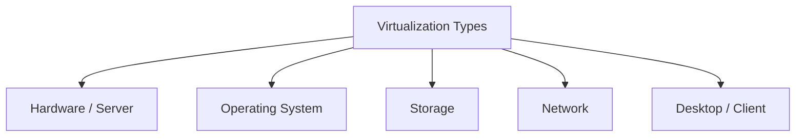

# Cloud Computing (231AM6E01) UNIT-III: Comprehensive Exam Report

> [!NOTE]
> This document provides highly detailed answers to your Unit-III questions. It is designed to help you score 15 to 20 marks per question. The language is simple, but the content is structured into Definitions, Core Mechanisms, Diagrams, Real-World Examples, and Comparisons.

---

## 1. Explain the characteristics of virtualized environments.

To score high marks, you must define virtualization simply and list its characteristics with detailed explanations.

**Introduction**
Virtualization is the process of creating a software-based (virtual) version of something, like a server, rather than a hardware-based one.

**Key Characteristics:**

1. **Resource Sharing (Multiplexing & Pooling):**
   - **What it is:** One single physical computer acts as multiple virtual computers.
   - **How it works:** The central software (Hypervisor) takes the physical CPU, RAM, and Storage and creates a "pool". It then shares this pool among many Virtual Machines (VMs).
   - **Benefit:** Huge cost savings because hardware is not wasted.

2. **Strict Isolation:**
   - **What it is:** Each VM is completely invisible to the other VMs.
   - **How it works:** If VM 'A' gets a virus or crashes, VM 'B' keeps running perfectly fine. They do not share software states.
   - **Benefit:** High security and safe testing environments.

3. **Software Encapsulation:**
   - **What it is:** A whole computer is packaged into a few software files.
   - **How it works:** The operating system, applications, and saved files of a VM are saved as simple computer files (like `.vmdk` files).
   - **Benefit:** You can easily copy, move, back up, or pause the VM by just moving these files.

4. **Hardware Independence:**
   - **What it is:** VMs do not care about the physical hardware brand.
   - **How it works:** Because the Hypervisor creates fake (virtual) hardware, you can copy a VM running on an IBM server and paste it onto an HP server without any errors.

5. **Live Migration (Mobility):**
   - **What it is:** Moving a running VM from one physical server to another.
   - **How it works:** Due to encapsulation, server admins can move a VM over the network without shutting it down. The user never notices.

6. **State Checkpointing:**
   - **What it is:** Taking a "snapshot" of the computer at an exact second.
   - **How it works:** You can save the exact state of the VM. If an update breaks the VM, you can click "restore" and go back in time instantly.

---

## 2. Describe the taxonomy of virtualization techniques.

**Introduction**
Taxonomy means the classification or types of virtualization. We can divide virtualization based on what part of the computer system is being virtualized.

**1. Hardware / Server Virtualization**
- **Meaning:** Creating virtual servers on top of a physical server.
- **Types:**
  - *Full Virtualization:* The VM is unaware it is virtualized.
  - *Paravirtualization:* The VM is modified to know it is virtualized.
  - *Hardware-Assisted:* The physical CPU has special chips to help.

**2. Operating System Level Virtualization (Containers)**
- **Meaning:** Instead of a Hypervisor, the Operating System is shared. 
- **How it works:** It splits the OS into secure boxes (Containers). Each box runs a different application. Docker is the best example.

**3. Storage Virtualization**
- **Meaning:** Grouping many physical hard drives into one massive virtual drive.
- **How it works:** A company might have 50 hard drives. Storage virtualization software makes it look like one giant 'C: Drive'. It makes managing data much easier.

**4. Network Virtualization**
- **Meaning:** Creating software-based networks independent of physical wires.
- **How it works:** You can create Virtual Local Area Networks (VLANs). Even if computers are in different buildings, the software networks them together as if they are in the same room.

**5. Desktop Virtualization (VDI)**
- **Meaning:** Running a personal computer desktop on a central server.
- **How it works:** A student logs into a cheap, weak laptop, but the screen shows Windows 11 running on a super-computer in the cloud. All the heavy lifting is done far away.

---

## 3. Explain the role of virtualization in cloud computing.

**Introduction**
Virtualization is the foundation engine of Cloud Computing. Without it, companies like Amazon Web Services (AWS) or Google Cloud could not exist. 

**Detailed Roles:**

1. **Creates "Infrastructure as a Service" (IaaS):**
   - Cloud computing sells computing power. Virtualization allows cloud providers to slice massive data centers into tiny, affordable virtual machines that anyone can rent.

2. **Shift from CapEx to OpEx (Money Savings):**
   - **CapEx (Capital Expense):** Buying physical servers is highly expensive.
   - **OpEx (Operating Expense):** Renting virtual servers costs only pennies per hour. Virtualization makes this possible. 

3. **High Availability and Disaster Recovery:**
   - If a physical server in a cloud data center catches fire, virtualization software notices it. It instantly restarts the virtual machines on a safe server in a different building.

4. **Dynamic Scaling (Elasticity):**
   - Cloud computing is famous for scaling. If an e-commerce website becomes popular during a festival sales day, the cloud provider uses virtualization to instantly add 10 more virtual servers to handle the traffic.

5. **Better Green Computing:**
   - Maintaining 100 physical servers requires massive electricity and cooling (AC). Through virtualization, those 100 servers can fit inside 10 highly powerful physical servers. This drastically reduces the carbon footprint.

---

## 4. Illustrate Hardware Virtualization Techniques.

Hardware virtualization involves a layer called the **Hypervisor** (or Virtual Machine Monitor - VMM). There are three primary ways to implement it.

### 1. Full Virtualization (Using Binary Translation)
- **Concept:** The guest Operating System (OS) expects to talk directly to hardware. Because it is virtualized, the Hypervisor traps the OS's commands and translates them step-by-step.
- **Key Feature:** The guest OS is **not modified**. You install Windows or Linux normally.
- **Pros:** High security; completely isolates the VM.
- **Cons:** It is slower because translating computer commands in real-time is difficult.

### 2. Paravirtualization
- **Concept:** "Para" means alongside. The guest OS is modified. Its code is changed to know that it is running inside a virtual machine.
- **Key Feature:** Instead of trying to talk to hardware, the modified OS sends special messages (called "Hypercalls") directly to the Hypervisor.
- **Pros:** Much faster than Full Virtualization because translation is eliminated.
- **Cons:** You cannot run standard Windows, because you cannot easily change Windows source code. It mostly works with open-source Linux systems.

### 3. Hardware-Assisted Virtualization
- **Concept:** The heavy lifting is taken away from the software and given to the physical processor (CPU).
- **Key Feature:** Intel created "Intel VT-x" chips, and AMD created "AMD-V" chips. These physical chips have built-in instructions for virtualization.
- **Pros:** It combines the speed of Paravirtualization with the ease of Full Virtualization. This is the modern standard used today.

---

## 5. Discuss the advantages and disadvantages of virtualization.

A 20-mark answer requires a detailed comparison.

### Advantages

1. **Drastic Hardware Cost Reduction:** You buy 1 server instead of 10.
2. **Space and Power Savings:** Fewer physical machines mean smaller server rooms and much lower electricity bills.
3. **Speed of Deployment:** Installing a physical server takes days (ordering, shipping, cabling). Starting a Virtual Machine takes exactly 2 minutes.
4. **Testing and Sandboxing:** Software engineers can write code inside a VM. If the code is buggy and destroys the machine, they simply delete the VM and start a new one. The host computer is 100% safe.
5. **Legacy Support:** If a company owns an old software that only runs on Windows 95, they don't need to keep a 25-year-old physical computer running. They can run a Windows 95 Virtual Machine on a modern server.

### Disadvantages

1. **High Initial CapEx:** While you buy fewer servers, the ones you do buy must be extremely powerful, which means a high starting cost.
2. **Performance Overhead:** A VM will never be 100% as fast as a "bare-metal" physical computer because the Hypervisor software uses about 5-10% of the CPU power to manage things.
3. **Single Point of Failure:** If you put 20 VMs inside one physical server, and that physical server breaks due to a power supply failure, all 20 VMs die instantly.
4. **VM Sprawl:** Because it is so easy to create VMs, employees might create hundreds of them and forget about them. This clogs up the network and wastes storage (called "sprawl").
5. **Complex Licensing:** Software companies like Microsoft or Oracle charge complicated licensing fees when their software is used in virtualized environments.

---

## 6. Explain the working of VMware and Xen.

You must explain both technologies and highlight their differences.

### VMware
VMware is a commercial company that dominates the virtualization market.
- **Main Product:** VMware ESXi.
- **Architecture Type:** It is a **Type-1 Hypervisor** (Bare Metal). This means you do not install Windows first. ESXi is the operating system. It sits directly on empty hardware. 
- **Working Mechanism:** VMware relies heavily on **Hardware-Assisted Full Virtualization**. When a Virtual Machine asks for memory, ESXi acts as a memory manager. It creates virtual memory tables and directly maps them to the physical hardware. The VMs have zero knowledge they are being virtualized.
- **Use Case:** Used by massive global banks, hospitals, and corporations for highly stable, easy-to-use virtual servers.

### Xen
Xen is an open-source virtualization project.
- **Architecture Type:** It was traditionally famous for **Paravirtualization**, though it supports all types today.
- **Working Mechanism:** 
  - Xen sits directly on the hardware. 
  - Xen has a special architecture using "Domains".
  - **Domain 0 (Dom0):** This is the master control Virtual Machine. It has special privileges. It contains all the drivers for the physical hardware. It controls the creation and destruction of other VMs.
  - **Domain U (DomU):** These are the normal, unprivileged user virtual machines. If a DomU wants to write data to a hard drive, it must ask Dom0 to do it for them.
- **Use Case:** Traditionally used by large cloud providers like early Amazon AWS because it is highly customizable and free.

---

## 7. Describe the building blocks of containers.

**Introduction**
Containers are a form of OS-level virtualization. Unlike VMs, they do not hold an entire operating system. They are built on three powerful Linux features.

### 1. Linux Namespaces (The "Walls")
- **Purpose:** Isolation.
- **How it works:** Namespaces restrict what a container can *see*. If a container runs an app, the namespace tricks the app into thinking it is the only app running on an empty computer.
- **Types of Namespaces:**
  - **PID:** Isolates process IDs.
  - **NET:** Gives the container its own set of IP addresses and network ports.
  - **MNT:** Gives the container its own private file folder system.
  - **USER:** Allows a container to have its own "root" user but safely map it to a normal user outside.

### 2. Control Groups / cgroups (The "Police")
- **Purpose:** Resource Allocation and Limiting.
- **How it works:** While namespaces limit what a container can *see*, cgroups limit what a container can *use*.
- **Function:** If you start a database container, you can use a cgroup rule: `Limit Memory = 500MB`. Even if the database tries to consume more memory, the cgroup will physically stop it, protecting the rest of the server.

### 3. Union File Systems (The "Layers")
- **Purpose:** Storage Efficiency.
- **How it works:** Think of UnionFS like a stack of transparent plastic sheets. Containers are built in layers. 
- **Example:** If you run 5 Ubuntu Linux containers, UnionFS only saves the core Ubuntu files ONCE on the hard drive (a read-only bottom layer). The 5 containers share that bottom layer and generate only tiny top-layers for their unique data. This is why containers take only seconds to start and use incredibly little disk space.

---

## 8. Explain container platforms such as LXC and Docker.

LXC and Docker are the two most important names in container history.

| Feature | LXC (Linux Containers) | Docker |
| :--- | :--- | :--- |
| **Philosophy** | **System Container:** Acts like a full virtual machine. | **Application Container:** Built to run just one single app. |
| **Ease of Use** | Difficult; requires complex Linux command knowledge. | Very Simple; uses a technology called the `Dockerfile`. |
| **Portability** | Hard to move between different computers. | Highly portable. Any Docker container will run anywhere. |
| **Speed** | Fast. | Extremely Fast. |

### LXC (Linux Containers)
- **Concept:** LXC is the grandfather of modern containers. It uses namespaces and cgroups directly.
- **Working:** It creates an environment that looks perfectly like a standard Linux installation. System Administrators can use SSH to log into an LXC container and install many different programs in it, just like a real PC.

### Docker
- **Concept:** Docker was created to fix the complexity of LXC. It created a standard way to package software.
- **Working Components:**
  - **Docker Engine:** The core program that manages the containers.
  - **Docker Image:** A read-only template. It contains the application code, libraries, and tools.
  - **Docker Container:** When you command Docker to "run" an image, it becomes a live, running container.
  - **Docker Hub:** A massive online library where developers share millions of pre-made Docker images (like an app store for code).

---

## 9. Explain container orchestration with an example.

**Introduction**
A developer can easily run 5 Docker containers manually on a laptop. But large tech companies run 50,000 containers across 5,000 servers. This is completely impossible to manage by hand. 

**What is Container Orchestration?**
It is automated software that manages the life cycle of containers. It is the "brain" of a massive container system.

**Key Functions of Orchestration:**
1. **Automated Scheduling:** Finding the best server to run a container. If Server A is 90% full, the orchestrator places the container on the empty Server B.
2. **Self-Healing:** If a web-server container suddenly crashes, the orchestrator detects the failure and instantly re-starts a fresh container to replace it.
3. **Auto-Scaling:** If your application suddenly gets 1 million visitors, the orchestrator notices the CPU usage going up and automatically spins up 50 new containers to handle the heavy traffic.
4. **Load Balancing:** It acts as a traffic director, dividing internet traffic equally among all the containers so none get overloaded.

**Example: Kubernetes (K8s)**
Kubernetes is the world's most famous orchestrator.
- **Analogy:** Imagine an airline company. The airplanes are the Servers. The passengers are the Containers. Kubernetes is the Airport Control Tower. The Control Tower decides which plane a passenger goes into, monitors if a plane is broken, and redirects passengers if a flight is canceled. 

---

## 10. Explain public cloud container services like Amazon Elastic Container Service.

Managing a container orchestrator (like Kubernetes) manually requires a team of highly paid engineering experts. It is very hard to keep running smoothly. Therefore, Public Clouds offer a solution: "Containers as a Service" (CaaS).

### Amazon Elastic Container Service (ECS)
**What it is:** ECS is a highly scalable, fully managed container orchestration service provided by Amazon Web Services (AWS).

**How it works:**
Instead of you installing orchestration software on empty servers, AWS manages the complex "Control Plane" (the master brain). You only focus on writing your application code inside Docker containers.

**Two Main Ways to Run ECS:**
1. **ECS on EC2 (Elastic Compute Cloud):**
   - You rent physical/virtual servers from Amazon.
   - ECS manages placing your containers onto those specific servers.
   - You are still responsible for updating and securing the servers underneath.
2. **ECS with AWS Fargate (Serverless Containers):**
   - This is the modern, preferred method.
   - You **do not** manage any servers. You completely ignore the hardware.
   - You just tell AWS: "Here is my container, it needs 2GB of RAM."
   - AWS finds space somewhere in their giant data center, runs the container, and you pay strictly for the exact seconds it was running. 

---

## 11. Compare Docker Swarm and Kubernetes.

Both are Container Orchestration tools, but they appeal to completely different user bases. Use this table to secure maximum marks.

| Characteristics | Docker Swarm | Kubernetes (K8s) |
| :--- | :--- | :--- |
| **Developer / Creator** | Docker Inc. | Google (Now managed by CNCF). |
| **Learning Curve** | **Easy.** It uses standard Docker commands. Easy for beginners. | **Extremely Steep.** Very difficult to learn and requires extensive study. |
| **Installation** | Very simple. Built directly into the Docker Engine by default. | Very complex. Requires many moving parts, certificates, and nodes. |
| **Scalability** | Good. Suitable for small to medium-sized applications. | **Massive.** Can handle hundreds of thousands of containers globally. |
| **Features** | Basic features (simple load balancing, manual scaling). | Advanced features (Custom resource definitions, complex rolling updates, auto-scaling). |
| **Community & Support**| Declining support. Many tools do not integrate with it anymore. | **The Industry Standard.** Endless plugins, community help, and cloud integrations. |
| **Best Used For** | Small startups wanting to go from a single laptop to a small cluster easily. | Enterprise giants (Netflix, Spotify, Banks) requiring absolute zero-downtime. |

---
*End of Report.* 
*Focus on the definitions, the "How it Works" sections, and the tables to fetch marks between 15 to 20 for these long-form examination questions.*
